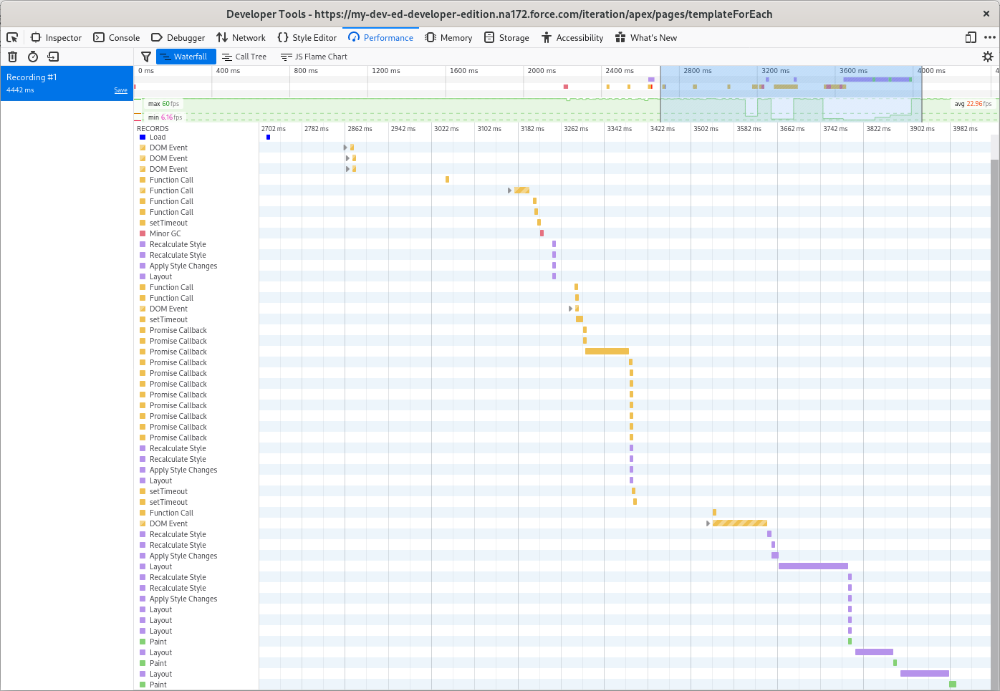
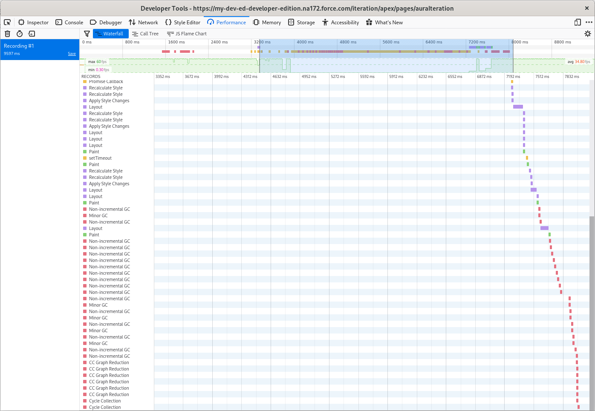

# Rendering Performance: Aura vs LWC

2/21/21

[Martin Glauber](mailto:martin.glauber@tython.co) & [Scott
Covert](mailto:scott.covert@tython.co)

If you haven’t already, there is a laundry list of reasons why your team
should make the switch from Aura to Lightning Web Components: Better
alignment with web standards. Less confusing state management. More
inviting to developers without prior Salesforce experience. The most
compelling reason, however, may be *performance*.

Since performance plays such a large role in overall user experience
it’s always a concern for us in our projects and we found the
performance gains to be had by switching from Aura to LWC are
substantial, especially if you’re rendering a large list of elements on
your page.

In Aura, the `aura:iteration` tag is used to loop through a collection
of items whereas LWC uses `template for:each`. To try to show just the
overhead for handling lists, we created a very simple lightning
component for each of the frameworks that just displays a list of
numbers on the page.

With a lightning web component, an iteration over a list with 10,000
elements completed in just over 1 second.

With a lightning aura component however, that same list took over 4
seconds from page load to painting.

 

We also found performance degraded exponentially in Aura as the list
size increased, to the point where the page eventually was completely
unusable.

If you’d like to test this out for yourself, check out [our
repo](https://github.com/tythonco/blog/tree/master/rendering-performance-aura-vs-lwc)
for sample code of the same component in both Aura and LWC format that
you can deploy to a scratch org for comparison.

If you could use a hand migrating from Aura to LWC or with another
Salesforce development project then [give us a
shout](mailto:support@tython.co), we’d be happy to help!